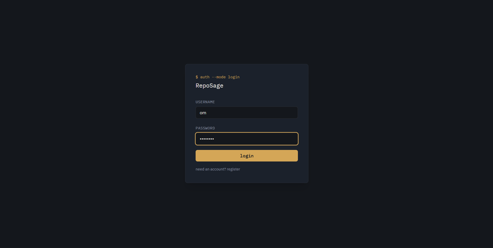
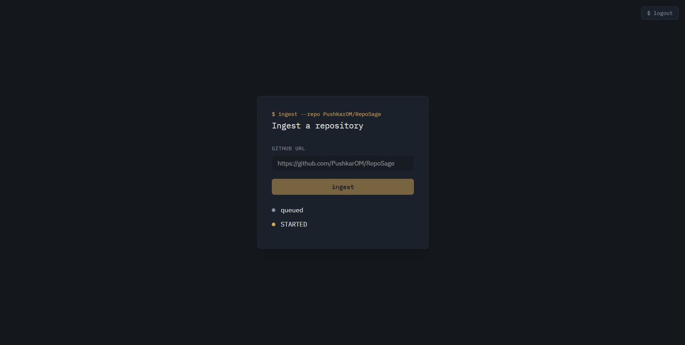
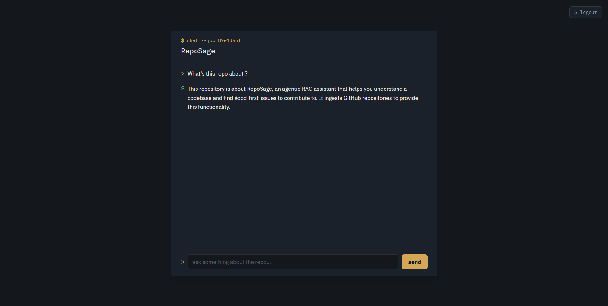
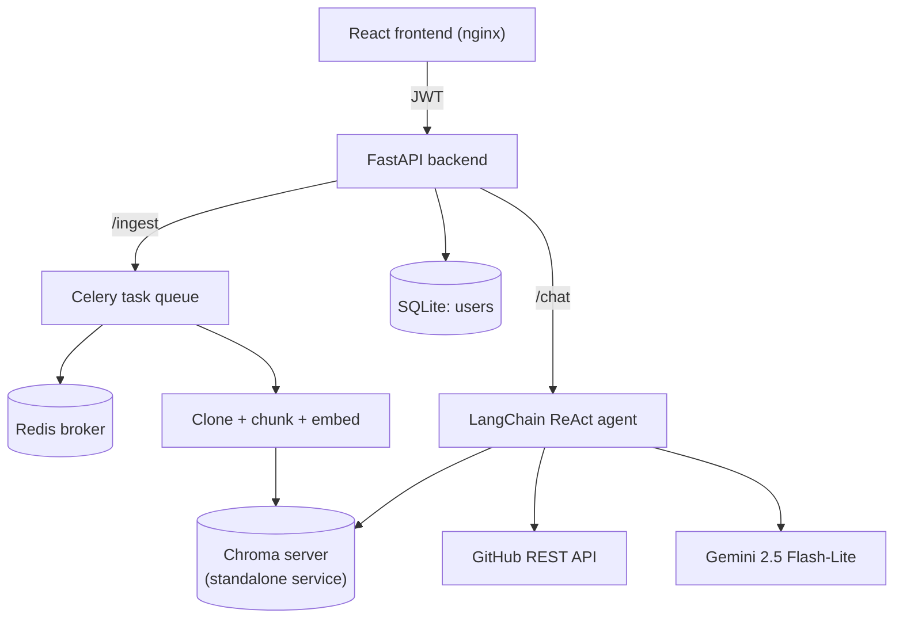

# RepoSage

An agentic RAG assistant that ingests a GitHub repository and helps you understand
the codebase, explore its structure, and find good-first-issues to contribute to —
through a conversational interface backed by a tool-using LLM agent.


## Screenshots

## Login



## Repository Ingestion



## Chat



## What it does

1. **Ingests** any public GitHub repo: clones it, splits code and documentation into
   separate language-aware chunks, embeds them, and stores them in a Chroma vector store.
2. **Runs ingestion asynchronously** via Celery + Redis, so a slow clone/embed job
   never blocks the API — the client polls a `/status/{job_id}` endpoint instead.
3. **Answers questions about the repo** through a LangChain ReAct agent with three tools:
   - `search_codebase` — semantic search over the ingested code/docs
   - `get_file` — retrieves a full file's contents for complete context
   - `list_good_first_issues` — pulls open `good first issue`-labeled issues from the GitHub API
4. **Remembers conversation context** per chat thread via a LangGraph checkpointer.
5. Exposes everything through a **JWT-protected FastAPI backend** with real multi-user
   auth (DB-backed, not a hardcoded demo user), and a **React frontend** for the full
   login → ingest → chat flow.

## Architecture
 

 
`api` and `worker` are separate processes that both need to read/write vector data.
Chroma runs as its **own standalone service** (not an embedded file-based client shared
by both processes) — both containers connect to it over HTTP via `chromadb.HttpClient`.
This was a real fix, not an initial design choice: an earlier version had both processes
opening the same embedded Chroma files directly, which caused intermittent index
corruption (`Error finding id`) under concurrent load. See [Known limitations](#known-limitations).
 
## Tech stack
 
| Layer | Choice | Why |
|---|---|---|
| Agent framework | LangChain (`create_agent`) + LangGraph checkpointer | Current (v1.x) agent-construction API; ReAct loop + memory out of the box |
| LLM | Google Gemini 2.5 Flash-Lite | Higher free-tier daily quota than full Flash; billing enabled in production for reliability under real usage |
| Embeddings | `sentence-transformers` (local, CPU) | Free, no API key needed to reproduce the project; pluggable to OpenAI via `EMBEDDING_PROVIDER` |
| Vector DB | ChromaDB, standalone server | Runs as its own service so both `api` and `worker` can safely share it concurrently |
| Async jobs | Celery + Redis | Standard Python async task queue; job-status polling pattern |
| API | FastAPI | JWT auth (`python-jose`), SQLAlchemy + SQLite user store |
| Frontend | React (Vite) + Tailwind v4 | Login → ingest → chat, polling-based status updates |
| Infra | Docker Compose | `api`, `worker`, `redis`, `chroma`, `frontend` services sharing a persistent volume |
| CI | GitHub Actions | Runs the pytest suite on every push/PR |
| Deployment | AWS EC2 (`t3.small`) | See [Live deployment](#live-deployment) |
 
## Setup
 
### Prerequisites
 
- Docker + Docker Compose (recommended path), **or** Python 3.12 + Node.js for native dev
- A [Google AI Studio](https://aistudio.google.com) API key
### Environment variables
 
Create `backend/.env`:
 
```
GOOGLE_API_KEY=your-gemini-api-key
JWT_SECRET_KEY=generate-a-random-hex-string
google_model_name=gemini-2.5-flash-lite
```
 
### Run with Docker Compose
 
The Compose stack now includes an `nginx`-served production build of the frontend.
Build the frontend once before bringing the stack up, or it'll serve an empty page:
 
```bash
cd frontend
npm install
npm run build
cd ..
 
docker compose build
docker compose up -d
```
 
- Full app: `http://localhost` (served by nginx, port 80)
- API docs: `http://localhost:8000/docs`
For active frontend development (hot reload, instant feedback), skip the nginx service
and run Vite's dev server instead, pointed at the same backend:
 
```bash
cd frontend
npm run dev
```
 
### Run natively (no Docker)
 
```bash
# Backend
cd backend
python -m venv .venv
.venv\Scripts\Activate.ps1      # Windows PowerShell
pip install -r requirements.txt
 
# Terminal 1: Redis + Chroma (still need containers for these two)
docker run -d -p 6379:6379 redis
docker run -d -p 8001:8000 chromadb/chroma
# set CHROMA_PORT=8001 in backend/.env to match the host mapping above
 
# Terminal 2: Celery worker
celery -A app.core.celery_app worker --loglevel=info --pool=solo
 
# Terminal 3: API
uvicorn app.main:app --reload
 
# Terminal 4: Frontend
cd frontend
npm install
npm run dev
```
 
### Running tests
 
```bash
cd backend
python -m pytest tests -v
```
 
## API reference
 
All endpoints except `/register` and `/login` require `Authorization: Bearer <token>`.
 
| Endpoint | Method | Description |
|---|---|---|
| `/register` | POST | Create a user account |
| `/login` | POST | Exchange credentials for a JWT (OAuth2 password flow) |
| `/ingest` | POST | Queue ingestion of a GitHub repo, returns a `job_id` |
| `/status/{job_id}` | GET | Poll Celery task state (`PENDING`/`STARTED`/`SUCCESS`/`FAILURE`) |
| `/chat` | POST | Send a message about an ingested repo (`job_id` + `message`) |
 
## Project structure
 
```
RepoSage/
├── backend/
│   ├── app/
│   │   ├── agent/        # tools.py, agent.py (ReAct agent + memory)
│   │   ├── api/          # FastAPI routes, auth, schemas
│   │   ├── core/         # config, celery app, DB, security, embeddings
│   │   ├── ingestion/     # clone, chunker, vectorstore, pipeline, Celery task
│   │   └── models/       # SQLAlchemy User model
│   ├── tests/
│   ├── Dockerfile
│   └── requirements.txt
├── frontend/              # React (Vite) + Tailwind v4
├── docker-compose.yml     # api, worker, redis, chroma, frontend (nginx)
└── .github/workflows/ci.yml
```
 
## Live deployment
 
Deployed on **AWS EC2** (`t3.small`, Amazon Linux 2023, 2GB RAM). Notes from actually
getting it running, kept here because they're the kind of thing that only shows up
under real usage, not local testing:
 
- **Memory is tight at this instance size** — both `api` and `worker` independently
  import `torch`/`sentence-transformers`, which costs several hundred MB per process
  before any real work happens. A 2GB swap file is configured on the host as a safety
  net against short memory spikes (e.g. during embedding model load), rather than
  sizing up to `t3.medium` outright.
- **An Elastic IP** is attached so the public address stays stable across instance
  stop/start cycles (stopping the instance when not actively demoing avoids paying
  for idle compute).
- **Billing is enabled** on the Gemini API key. The free tier's daily request quota
  (as low as 20 requests/day on some models, as of testing) is fine for solo
  development but gets exhausted quickly under real multi-user demo traffic.
- The Chroma **concurrency bug** described in [Architecture](#architecture) was
  actually found via a friend testing the live deployment concurrently with ingestion
  running — a good example of a bug that only surfaces under real concurrent load,
  not solo local testing.

## Known limitations
 
Deliberate scoping decisions for a portfolio-scale project, noted explicitly:
 
- **Conversation memory is in-process (`InMemorySaver`)** — lost on restart, not shared
  across multiple worker instances. A production version would back this with Redis or Postgres.
- **SQLite for the user DB** — fine at this scale; would move to Postgres for multi-instance deployment.
- **No schema migrations (Alembic)** — tables are created via `create_all()`, not versioned.
- **Unauthenticated GitHub API calls** for `list_good_first_issues` — capped at 60 requests/hour.
- **CORS is wide open (`allow_origins=["*"]`)** — fine for a demo behind a single known
  frontend, should be scoped to a specific origin for any real production use.
- **Single Chroma instance, no replication** — the concurrency *bug* is fixed (one
  owning process instead of two), but there's still a single point of failure if that
  container goes down; acceptable for a demo, not for production.

## Roadmap
 
- [x] Deploy to AWS EC2
- [ ] Migrate to a platform (e.g. Render) for always-on hosting without manual start/stop
- [ ] Persistent, shared conversation memory (Redis-backed checkpointer)
- [ ] Alembic migrations
- [ ] Authenticated GitHub API calls
