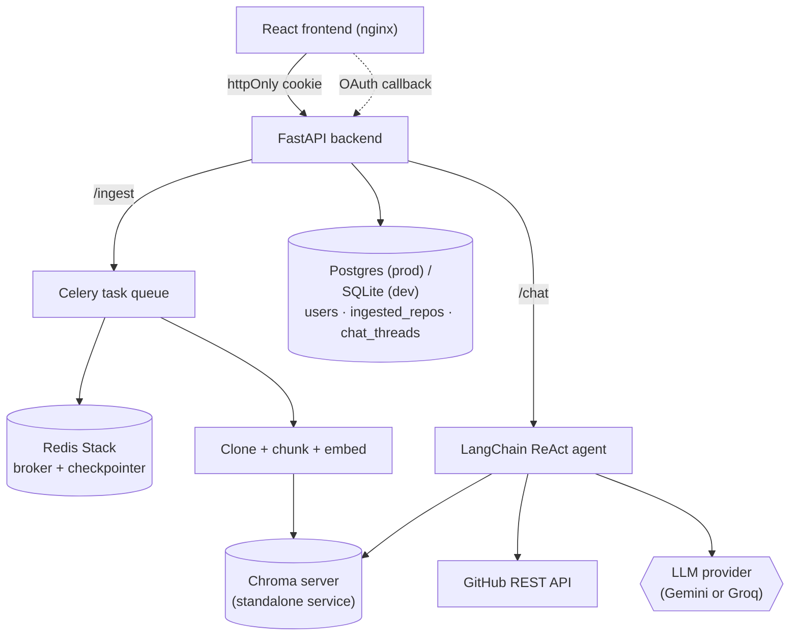

# RepoSage

An agentic RAG assistant that ingests a GitHub repository and helps you
understand the codebase, explore its structure, and find good-first-issues
to contribute to — through a streaming conversational interface backed by a
tool-using LLM agent with hybrid (vector + BM25) retrieval.


## Screenshots

## Login


## Repository Ingestion


## Chat


## What it does

1. **Ingests any GitHub repo** (public, or private if you've linked your
   GitHub account via OAuth). Clones it, splits code and documentation into
   language-aware chunks, embeds them with `sentence-transformers`, and
   stores them in Chroma.
2. **Runs ingestion asynchronously** via Celery + Redis Stack, so a slow
   clone/embed job never blocks the API. The client subscribes to an
   SSE stream (`/ingest/stream/{job_id}`) backed by Redis pub/sub, with a
   90s liveness watchdog in case the worker dies hard.
3. **Retrieves with hybrid search** (vector similarity + BM25, fused via
   reciprocal rank fusion). Pure vector was the original baseline; Phase 4
   swapped it for hybrid after the eval harness showed a measurable
   improvement on the curated test set.
4. **Answers questions through a LangChain ReAct agent** with 10 tools
   covering semantic search, file reading, symbol navigation, git history,
   test discovery, dependency analysis, and contribution guidance.
5. **Streams responses token-by-token** to the frontend via
   `agent.astream()` (LangGraph). The chat UI renders each chunk as it
   arrives.
6. **Remembers conversation context per thread** via a Redis-backed
   LangGraph checkpointer (`AsyncRedisSaver` over Redis Stack). Threads
   survive restarts and are scoped per-user.
7. **Keeps a per-user record of ingested repos and chat threads** in
   PostgreSQL (Neon in prod, SQLite for local dev), so users can resume
   chatting without re-ingesting.
8. **Exposes everything through a cookie-authenticated FastAPI backend** with a
   per-user rate limiter and a React frontend for the full
   login → link-GitHub → ingest → chat flow. Tokens ride in httpOnly
   cookies (`SameSite=Lax`); the frontend silently refreshes on 401 via a
   single-flight `/refresh` call.

## Architecture



`api` and `worker` are separate processes that both need to read/write
vector data. Chroma runs as its own standalone service (not an embedded
file-based client shared by both processes) — both containers connect to it
over HTTP via `chromadb.HttpClient`. This was a real fix, not an initial
design choice: an earlier version had both processes opening the same
embedded Chroma files directly, which caused intermittent index corruption
(`Error finding id`) under concurrent load. See [Known limitations](#known-limitations).

## Tech stack

| Layer | Choice | Why |
|---|---|---|
| Agent framework | LangChain (`create_agent`) + LangGraph | Current (v1.x) agent-construction API; ReAct loop + streaming + memory out of the box |
| Agent memory | LangGraph `AsyncRedisSaver` over Redis Stack | Survives restarts, shareable across replicas; async variant required once token streaming was added |
| LLM | Google Gemini 2.5 Flash-Lite (default) or Groq Llama 3.3 70B | Pluggable via `LLM_PROVIDER`; Groq used during development for higher free-tier quota and lower latency |
| Embeddings | `sentence-transformers` (local, CPU) | Free, no API key needed to reproduce the project; pluggable to OpenAI via `EMBEDDING_PROVIDER` |
| Retrieval | Hybrid: vector (Chroma) + BM25 (in-memory), fused via weighted reciprocal rank fusion | Pure vector was the baseline; hybrid ties on R@5 with vector-only on the eval harness and adds BM25 keyword rescue for cases the embedding model misses (see [Eval harness](#eval-harness)) |
| Vector DB | ChromaDB, standalone server | Runs as its own service so both `api` and `worker` can safely share it concurrently |
| Async jobs | Celery + Redis Stack + Redis pub/sub | Standard Python async task queue; ingest progress streamed via SSE, not polling |
| API | FastAPI | httpOnly-cookie auth (`python-jose` for the underlying JWT), SQLAlchemy + Alembic, per-user rate limiting |
| Database | Postgres (Neon in prod) / SQLite (dev) | Alembic-managed schema; three tables: `users`, `ingested_repos`, `chat_threads` |
| Frontend | React 19 (Vite) + Tailwind v4 + shadcn-style Button | Login → ingest → chat with streaming + per-repo thread history |
| Infra | Docker Compose | `api`, `worker`, `redis`, `chroma`, `frontend` services sharing a persistent volume |
| CI | GitHub Actions | Runs the pytest suite on every push/PR |

## The agent's toolbox

The ReAct agent has access to 10 tools. They're documented in detail in
`backend/app/agent/tools.py`; the short version:

| Tool | What it does |
|---|---|
| `search_codebase` | Hybrid semantic + keyword search over the ingested chunks, optional `code`/`doc` filter |
| `get_file` | Full contents of a named file (with path-traversal safety) |
| `read_file_section` | Bounded line-range read of a file, with line numbers — for "show me the rate_limit function" |
| `find_definition` | Where a symbol (function, class, module-level var) is defined |
| `find_references` | Where a symbol is used — the natural follow-up to `find_definition` |
| `list_recent_changes` | Recent git log, optionally scoped to a path |
| `find_tests_for` | Test files that cover a given source file (heuristic: co-located + standard test dirs + import-pattern grep) |
| `list_dependencies` | Third-party packages the repo imports, ordered by usage frequency |
| `get_directory_structure` | A directory tree of the whole repo, for "what modules exist" questions |
| `list_good_first_issues` | Open `good first issue`-labelled issues from the GitHub API |

`search_codebase`, `get_file`, and `list_good_first_issues` are the three
original tools from the first version of the project; the other seven
were added in Phase 4 as part of the broader RAG-quality pass.

## Eval harness

`backend/eval/run_eval.py` is an offline retrieval benchmark that compares
three retrievers head-to-head against a curated set of test cases:

- **`vector_only`** — the original baseline (pure cosine similarity).
- **`multi_query`** — vector search with LLM-expanded query rewriting.
- **`hybrid`** — current production retriever: BM25 + vector, fused via
  reciprocal rank fusion, with cheap routing that skips BM25 on
  exact-path / short-identifier queries to keep the fast path fast.

Run manually against an already-ingested repo:

```bash
cd backend
python -m eval.run_eval <repo_id>
```

It's deliberately not part of pytest/CI: it needs live Chroma data and a
real LLM call, and the headline number can drift slightly run to run
(multi-query expansion legitimately has 100-300ms of variance). The
harness writes a JSON snapshot of the latest run to
`backend/eval/last_run.json` for cross-session diffing.

## Setup

### Prerequisites

- Docker + Docker Compose (recommended path), **or** Python 3.12 + Node.js
  for native dev
- A [Google AI Studio](https://aistudio.google.com) API key (or a
  [Groq](https://console.groq.com) API key if switching `LLM_PROVIDER`)

### Environment variables

Create `backend/.env`:

```bash
# Required
GOOGLE_API_KEY=your-gemini-api-key
JWT_SECRET_KEY=generate-a-random-hex-string       # access tokens
JWT_REFRESH_SECRET_KEY=generate-a-different-one   # refresh tokens -- MUST differ
google_model_name=gemini-2.5-flash-lite

# Optional — defaults shown
COOKIE_SECURE=false                                 # true in prod (HTTPS)
CORS_ALLOWED_ORIGINS=["http://localhost:5173"]      # JSON list; add prod origin in prod
GROQ_API_KEY=                                       # if switching LLM_PROVIDER=groq
GH_CLIENT_ID=                                       # for GitHub OAuth (private repos)
GH_CLIENT_SECRET=
GH_REDIRECT_URI=http://127.0.0.1:8000/auth/github/callback
FRONTEND_BASE_URL=http://localhost
DATABASE_URL=sqlite:///./reposage.db                 # postgres://... in prod
```

### Run with Docker Compose

The Compose stack includes an `nginx`-served production build of the
frontend. The frontend image builds itself in place, so no manual
pre-step is needed:

```bash
docker compose build
docker compose up -d
```

- Full app: <http://localhost> (served by nginx, port 80)
- API docs: <http://localhost:8000/docs>

For active frontend development (hot reload, instant feedback), skip the
nginx service and run Vite's dev server instead, pointed at the same
backend:

```bash
cd frontend
npm install
npm run dev
```

### Run natively (no Docker)

```bash
# Backend
cd backend
python -m venv .venv
.venv\Scripts\Activate.ps1      # Windows PowerShell
pip install -r requirements.txt

# Terminal 1: Redis Stack + Chroma (still need containers for these)
docker run -d -p 6379:6379 redis/redis-stack-server
docker run -d -p 8001:8000 chromadb/chroma
# set CHROMA_PORT=8001 in backend/.env to match the host mapping above

# Terminal 2: Celery worker
celery -A app.core.celery_app worker --loglevel=info --pool=solo

# Terminal 3: API
uvicorn app.main:app --reload

# Terminal 4: Frontend
cd frontend
npm install
npm run dev
```

### Running tests

```bash
cd backend
python -m pytest tests -v
```

The pytest suite covers auth, rate limiting, repo management, and the
chunker. Retrieval quality is measured by the separate eval harness
(see above), not by pytest.

## API reference

All endpoints except `/register`, `/login`, and `/refresh` require a
valid `reposage_token` httpOnly cookie. The browser sends it
automatically; in `TestClient` it's attached from the cookie jar after
`/login`. CSRF defense is `SameSite=Lax` on the cookie — cross-origin
POST/PUT/DELETE from any other site won't carry it.

| Endpoint | Method | Description |
|---|---|---|
| `/register` | POST | Create a user account |
| `/login` | POST | Exchange credentials; sets `reposage_token` + `reposage_refresh` cookies |
| `/refresh` | POST | Rotate the refresh cookie (returns new access + refresh cookies) |
| `/logout` | POST | Revoke the refresh-token hash on the User row + delete both cookies |
| `/repos` | GET | List the current user's ingested repos |
| `/ingest` | POST | Queue ingestion of a GitHub repo, returns a `job_id` |
| `/repos/reingest` | POST | Re-trigger ingestion for a repo already in the user's library |
| `/status/{job_id}` | GET | Read job state from the DB (`QUEUED`/`RUNNING`/`SUCCESS`/`FAILED`/`UNKNOWN`) |
| `/ingest/stream/{job_id}` | GET | SSE stream of live ingest status updates |
| `/repos/{owner}/{name}/threads` | GET | List chat threads for a repo |
| `/threads` | POST | Create a new chat thread for a repo |
| `/threads/{thread_id}` | PATCH | Rename a thread |
| `/threads/{thread_id}/auto-title` | POST | LLM-generate a thread title from the first message |
| `/threads/{thread_id}/messages` | GET | Load conversation history for a thread |
| `/chat` | POST | Send a message (non-streaming; used by the eval harness and scripted tools) |
| `/chat/stream` | POST | Send a message, stream the response as `text/plain` |
| `/auth/github/login` | GET | Begin GitHub account-linking flow |
| `/auth/github/callback` | GET | OAuth callback that stores the GitHub access token on the user |
| `/auth/github/status` | GET | Whether the current user has linked GitHub |

## Project structure

```
RepoSage/
├── backend/
│   ├── app/
│   │   ├── agent/        # tools.py, agent.py, context.py (ReAct agent + memory + tool runtime)
│   │   ├── api/          # FastAPI routes, auth, schemas
│   │   ├── core/         # config, celery app, db, security, embeddings, rate limiter, llm factory
│   │   ├── ingestion/    # clone, chunker, structure, vectorstore (hybrid + multi_query), pipeline, tasks
│   │   └── models/       # SQLAlchemy: User, IngestedRepo, ChatThread
│   ├── alembic/          # schema migrations
│   ├── eval/             # offline retrieval benchmark (run_eval.py, test_cases.py)
│   ├── tests/            # pytest suite
│   ├── Dockerfile
│   └── requirements.txt
├── frontend/             # React 19 (Vite) + Tailwind v4
│   └── src/
│       ├── components/   # PromptBar, Message, MessageList, ThemeToggle, LogoutButton, ui/button
│       ├── pages/        # Landing, Auth, Dashboard, Ingest, ThreadList, Chat
│       ├── context/      # AuthContext
│       └── lib/          # utils (cn helper), copy (TAGLINE/REPO/PORTFOLIO/CONTACT), useTheme, api (authFetch)
├── docker-compose.yml
├── docker-compose.dev.yml
├── docs/screenshots/
├── .github/workflows/ci.yml
└── ProjectPlan.md        # per-phase progress log, infra decisions, session notes
```

## Live deployment

Deployed on **AWS EC2** (`t3.small`, Amazon Linux 2023, 2GB RAM). Notes
from actually getting it running, kept here because they're the kind of
thing that only shows up under real usage, not local testing:

- **Memory is tight at this instance size** — both `api` and `worker`
  independently import `torch`/`sentence-transformers`, which costs
  several hundred MB per process before any real work happens. A 2GB
  swap file is configured on the host as a safety net against short
  memory spikes (e.g. during embedding model load), rather than sizing
  up to `t3.medium` outright.
- **An Elastic IP** is attached so the public address stays stable
  across instance stop/start cycles (stopping the instance when not
  actively demoing avoids paying for idle compute).
- **Postgres is hosted on Neon**, not the EC2 instance. The dev SQLite
  is fine for local; production needs a serverless-friendly managed DB
  because the EC2 instance is intended to be turned off between demos.
- **Billing is enabled** on the LLM API keys. The free tier's daily
  request quota (as low as 20 requests/day on some Gemini models at
  time of testing) is fine for solo development but gets exhausted
  quickly under real multi-user demo traffic.
- The Chroma **concurrency bug** described in [Architecture](#architecture)
  was actually found via a friend testing the live deployment concurrently
  with ingestion running — a good example of a bug that only surfaces
  under real concurrent load, not solo local testing.

## Known limitations

Deliberate scoping decisions for a portfolio-scale project, noted
explicitly:

- **Single Chroma instance, no replication** — the concurrency *bug* is
  fixed (one owning process instead of two), but there's still a single
  point of failure if that container goes down; acceptable for a demo,
  not for production.
- **No job status distinction for unknown job IDs (legacy)** —
  `/status/{job_id}` now reads from the `IngestedRepo` row, so an
  unknown `job_id` returns `UNKNOWN` (HTTP 200, but state string) instead
  of the ambiguous `PENDING` from `celery.AsyncResult`. The SSE endpoint
  returns 404 directly when the user doesn't own the job, which is a
  stronger signal than a state string.
- **CORS is scoped to explicit origins** (`allow_credentials=True`
  requires a non-wildcard list) — `http://localhost:5173` in dev plus
  the prod frontend origin in production. Cookies cross origins only on
  top-level navigations under `SameSite=Lax`, which is the entire CSRF
  defense: no separate token needed.
- **GitHub API calls cap at 60 req/hour per IP** for unauthenticated
  `list_good_first_issues` use. Linking a GitHub account raises the
  cap to 5000/hour via the user's stored OAuth token.
- **The eval harness is a developer tool, not a CI gate.** It's slow
  and has LLM-dependent variance; running it in CI would mean
  non-deterministic failures.
- **Rate limits are per-user, fixed-window daily** — fine for a demo,
  would want token-bucket / sliding window for production fairness.

## Roadmap

### Phase 5 — Ops maturity
- [x] Multi-stage frontend Dockerfile (build inside the image, not a
      manual pre-step) — shipped with the landing refresh; the
      `frontend/Dockerfile` runs `npm run build` in a `node:22-alpine`
      stage and copies the dist into `nginx:alpine`
- [ ] Move off manually-managed EC2 to Render (or similar) for
      always-on hosting
- [ ] Auto-deploy on merge to `main`

### Future
- [ ] Streaming-friendly per-token UI polish (smoother mid-stream
      handling on the assistant bubble — a 45ms word-drain is in place,
      but large server deltas still cause occasional "dumpy jumps")
- [ ] Per-repo chat shell with resizable thread aside (ChatGPT-style
      layout; would use `react-resizable-panels`)
- [ ] Search/filter inside a repo's thread list

See `ProjectPlan.md` for the full per-phase log, infra decisions, and
session notes going back to the start of the project.
