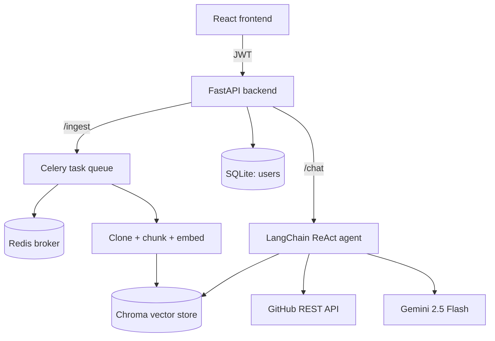

# RepoSage

An agentic RAG assistant that ingests a GitHub repository and helps you understand
the codebase, explore its structure, and find good-first-issues to contribute to —
through a conversational interface backed by a tool-using LLM agent.


## Screenshots

## Login


## Repository Ingestion


## Chat


## What it does

1. **Ingests** any public GitHub repo: clones it, splits code and documentation into
   separate language-aware chunks, embeds them, and stores them in a Chroma vector store.
2. **Runs ingestion asynchronously** via Celery + Redis, so a slow clone/embed job
   never blocks the API — the client polls a `/status/{job_id}` endpoint instead.
3. **Answers questions about the repo** through a LangChain ReAct agent with three tools:
   - `search_codebase` — semantic search over the ingested code/docs
   - `get_file` — retrieves a full file's contents for complete context
   - `list_good_first_issues` — pulls open `good first issue`-labeled issues from the GitHub API
4. **Remembers conversation context** per chat thread via a LangGraph checkpointer.
5. Exposes everything through a **JWT-protected FastAPI backend** with real multi-user
   auth (DB-backed, not a hardcoded demo user), and a **React frontend** for the full
   login → ingest → chat flow.

## Architecture



## Tech stack

| Layer | Choice | Why |
|---|---|---|
| Agent framework | LangChain (`create_agent`) + LangGraph checkpointer | Current (v1.x) agent-construction API; ReAct loop + memory out of the box |
| LLM | Google Gemini 2.5 Flash | Genuine ongoing free tier, strong tool-calling, no billing required to run this project |
| Embeddings | `sentence-transformers` (local, CPU) | Free, no API key needed to reproduce the project; pluggable to OpenAI via `EMBEDDING_PROVIDER` |
| Vector DB | ChromaDB | Embedded, file-persisted, single collection with metadata filtering (`type`, `job_id`) |
| Async jobs | Celery + Redis | Standard Python async task queue; job-status polling pattern |
| API | FastAPI | JWT auth (`python-jose`), SQLAlchemy + SQLite user store |
| Frontend | React (Vite) + Tailwind v4 | Login → ingest → chat, polling-based status updates |
| Infra | Docker Compose | `api`, `worker`, `redis` services sharing one persistent volume |
| CI | GitHub Actions | Runs the pytest suite on every push/PR |

## Setup

### Prerequisites

- Docker + Docker Compose (recommended path), **or** Python 3.12 + Node.js for native dev
- A free [Google AI Studio](https://aistudio.google.com) API key (no billing required)

### Environment variables

Create `backend/.env`:

```
GOOGLE_API_KEY=your-gemini-api-key
JWT_SECRET_KEY=generate-a-random-hex-string
google_model_name=gemini-2.5-flash-lite
```

### Run with Docker Compose (recommended)

```bash
docker compose build
docker compose up
```

- API: `http://localhost:8000` (interactive docs at `/docs`)
- Frontend: run separately (see below) — it's not containerized in this setup, since it's a
  static Vite dev build; a production build could be added to a fourth Compose service.

```bash
cd frontend
npm install
npm run dev
```

Open the printed `localhost` URL, register a user, paste a public GitHub repo URL, and chat
once ingestion completes.

### Run natively (no Docker)

```bash
# Backend
cd backend
python -m venv .venv
.venv\Scripts\Activate.ps1      # Windows PowerShell
pip install -r requirements.txt

# Terminal 1: Redis (still needs Docker, or a native Redis install)
docker run -d -p 6379:6379 redis

# Terminal 2: Celery worker
celery -A app.core.celery_app worker --loglevel=info --pool=solo

# Terminal 3: API
uvicorn app.main:app --reload

# Terminal 4: Frontend
cd frontend
npm install
npm run dev
```

### Running tests

```bash
cd backend
python -m pytest tests -v
```

## API reference

All endpoints except `/register` and `/login` require `Authorization: Bearer <token>`.

| Endpoint | Method | Description |
|---|---|---|
| `/register` | POST | Create a user account |
| `/login` | POST | Exchange credentials for a JWT (OAuth2 password flow) |
| `/ingest` | POST | Queue ingestion of a GitHub repo, returns a `job_id` |
| `/status/{job_id}` | GET | Poll Celery task state (`PENDING`/`STARTED`/`SUCCESS`/`FAILURE`) |
| `/chat` | POST | Send a message about an ingested repo (`job_id` + `message`) |

## Project structure

```
RepoSage/
├── backend/
│   ├── app/
│   │   ├── agent/        # tools.py, agent.py (ReAct agent + memory)
│   │   ├── api/          # FastAPI routes, auth, schemas
│   │   ├── core/         # config, celery app, DB, security, embeddings
│   │   ├── ingestion/     # clone, chunker, vectorstore, pipeline, Celery task
│   │   └── models/       # SQLAlchemy User model
│   ├── tests/
│   ├── Dockerfile
│   └── requirements.txt
├── frontend/              # React (Vite) + Tailwind v4
├── docker-compose.yml
└── .github/workflows/ci.yml
```

## Known limitations

These are deliberate scoping decisions for a portfolio-scale project, not oversights —
noted here so the tradeoffs are explicit:

- **Conversation memory is in-process (`InMemorySaver`)** — lost on restart, not shared
  across multiple worker instances. A production version would back this with Redis or Postgres.
- **SQLite for the user DB** — fine at this scale; would move to Postgres for multi-instance deployment.
- **No schema migrations (Alembic)** — tables are created via `create_all()`, not versioned.
- **Unauthenticated GitHub API calls** for `list_good_first_issues` — capped at 60 requests/hour.
  A personal access token would raise this to 5,000/hour.
- **CORS is wide open (`allow_origins=["*"]`)** for local development — should be scoped to a
  specific origin before any real deployment.
- **Gemini's free tier has tight, frequently-changing rate limits.** The agent includes basic
  retry/backoff, but heavy usage will still hit daily quotas — see Google AI Studio's dashboard
  for current limits.

## Roadmap

- [ ] Deploy to AWS EC2 (in progress)
- [ ] Persistent, shared conversation memory (Redis-backed checkpointer)
- [ ] Alembic migrations
- [ ] Authenticated GitHub API calls


